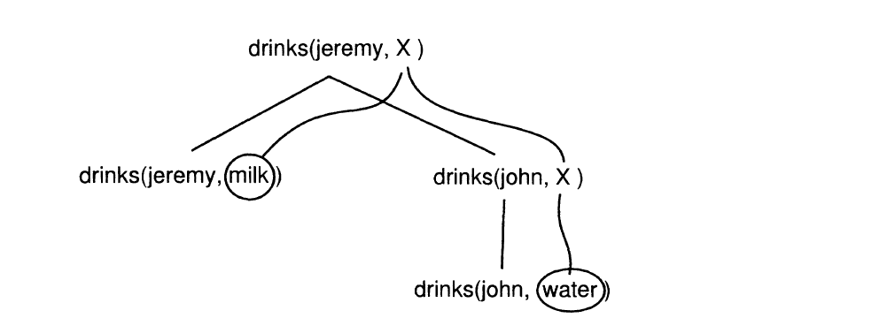

## Chapter 11

The idea behind logic programming is that the programmer should state the _relationships_
that describe a problem and its solution. These relationships act as constraints on the
algorithms that can solve the problem, but the system itself, rather than the programmer,
is responsible for the details of the algorithm.

We shall view functional programming as computation in evaluation mode (no information
guessing is allowed) and relational programming as computation in a deduction mode
(information guessing is allowed.)

### Prolog

A Prolog program consists of a collection of _procedures_. Each procedure defines a
particular _predicate_, being a certain relationship between its arguments. A procedure
consists of one or more assertions, or _clauses_. It is convenient to think of two kinds of
clauses: _facts_ and _rules_.

_In Prolog, there's not often a finely detailed step-by-step recipe._ If you find the
relation you have to write few lines of code.

**Tip**: All Prolog code lives in a data base.

Prolog contains three principal elements: The _terms_ that represent data objects (data
structures), the _fact_ and _rules_ that specifies relationships between terms, and the
_queries_  that ask questions about how terms are related with respect to a collection of
facts and rules. **Terms** include such simple objects as _atoms_, _numbers_, and
_variables_, and more complex objects called _structures_.

- ```term``` is _atom_ or _variable_ or _structure_(compound terms e.g. list)

- ```(symbolic) atom``` is any sequence of lower- and uppercase letters, digits, and the
                        special symbol _underscore_ ```_``` that begins with a lowercase
                        letter. They refer to specific objects, and to specific relations

- ```(logical) variable``` is any sequence of lower and uppercase letters, digits, and the
                           special symbol _underscore_ that begins with uppercase letter or
                           the underscore.

Programmers can consider logical variables as named 'holes' in data structures.

- ```list``` is **[H|T]**

**NOTE:** It is not mentioned in book but list in Lisp implementation is cons cells: ```(first . rest)```

- ```;``` is logical **OR**

- ```,``` is logical **AND**, separates goals

- ```=``` represents unification in Prolog

- ```relation``` relates a collection of terms. E.g. _identifier(component [, component]...)_
A relation with **n** components is called an _n-ary_ relation. **n** is said to be the
_arity_ of the relation. A _0-ary_ relation is called a _propositional relation_ or just
_proposition_.

- ```fact``` asserts the truth of a relation. _fact_ is _relation._ **Note** the period that
             follows the relation.

- ```rule``` is _conclusion :- condition [,condition] ..._**.**. **rule** asserts the conditional
truth of a relation. Each rule must contains at least one condition. Like **facts**, rules
are terminated with a period.

- ```clauses``` are rules or facts.

- ```query``` is **?-** _relation [, relation]..._ **.**. **query** - a question asking
              whether a sequence of terms are related. Like **facts**, queries are
              terminated with a period.

#### Unification

Unification is a process of matching terms.

A principle called _unification_ governs the process of instantiating variables with
terms. Unification is basically an attempt to _match_ two terms, by instantiating the
variables contained in the terms. _Thus, substitution plays a central role in the process._
A _substitution_ is a set of mappings from variables to terms.

**Tip:** Unification also serves as the parameter passing mechanism, and provides a constructor and
     selector of data structures.

If two variables unify with each other, then they _co-refer_: that is, the both refer to the
same term. The anonymous variable will unify with any term, and does not co-refer with any
term.

##### Execution model

Given a program consisting of clauses, the way to use the program is to pose _queries_
about it.

- When Prolog seeks to resolve a query or condition of a rule, it searches that data base of
  facts and rules from top to bottom for either a fact relation of the conclusion relation
  of a rule that will unify with the query of condition relation.

- A basic computational mechanism in Prolog is _relational resolution_. A query or condition
  relation and a conclusion relation _resolve_ if the have the same relation name, the same
  relation arity, and their terms in each respective component position unify.


#### Backtracking

_Backtracking is basically a form of searching._ In the context of Prolog, suppose that the
Prolog interpreter is trying to satisfy a sequence of goals **goal_1**, **goal_2**.
When the Prolog interpreter finds a set of variable bindings which allow **goal_1** to be
satisfied, it commits itself to those bindings, and then seeks to satisfy **goal_2**.

Eventually one of two things happens:
- **goal_2** is satisfied and finished with
- **goal_2** cannot be satisfied.

In either case, Prolog backtracks. That is, it _"un-commits"_ itself to the variable
bindings it made in satisfying **goal_1** and goes looking for a different set of variable
bindings that allow **goal_1** to be satisfied. If it finds a second set of such bindings,
it commits to them, and proceeds to try to satisfy **goal_2** again, with the new
bindings. In case (a), the Prolog interpreter is looking for extra solutions, while in
case (b) it is still looking for the first solution. So backtracking may serve to find
extra solutions to a problem, or to continue the search for a first solution, when a first
set of assumptions (i.e. variable bindings) turns out not to lead to a solution.

**Tip:** Automatic backtracking provides generate-and-test as the basic control flow
     model. This is more general than the strict unidirectional sequential flow of control in
     conventional languages.

#### Programming in Prolog

How do we know whether a grammatically correct program will do what it is supposed to? In
Prolog, the answer is perhaps clearer than in other programming languages. A Prolog
program is a knowledge base made up of _clauses_. Each of those clauses is an encoding of an
atomic or conditional sentence. To answer the question, we need to consider the truth of
these sentences. It is almost enough. There are two additional points to remember:

* _A program might not contain all possible truths about a matter._ So some truths might
  be missing, for a variety of good reasons. This must be accepted, and sometimes
  documented with comments.

* _But a program must include all relevant truths, explicitly or implicitly._ The reason is
  that this clause can be derived from other clauses using back-chaining; its truth is
  represented implicitly by the program. So to capture the whole truth, one needs to allow
  for the fact that some of it will be calculated by back-chaining over the knowledge
  base.

```
Writing a Prolog program involves building a knowledge base of clauses that
captures:

1. the truth, and nothing but,
2. the whole truth,
3. in a form suitable for back-chaining.
```

#### Recursion

* When writing recursive Prolog programs, there is no simple way to guarantee that they will
  terminate. However, a good rule of thumb is that when a clause is recursive, the
  _recursive predicate should appear toward the end of the clause, so that new
  variables can be instantiated._

* A recursive program will terminate if the query that matches the head of a clause is
  always bigger (according to the size measure being used) than the queries from the
  body of the clause.

#### Arithmetic

One restriction on the use of _arithmetic expressions_ is that the variables in them must
already have values. Prolog provides a built-in predicate for the purpose of evaluating
terms according to the rules of arithmetic. This predicate is called ```is```, and it can
be written as an infix operator.

```prolog
?- X is 2+2*2.
X=6

coeff(A,X,B,Y) :- Y is A*X+B.
?- coeff(2, 2, 2, 6).
yes
?- coeff(1+7, 2*2, 4, V).
Y=36
```

#### How Prolog finds solution?

```prolog
drinks(john, water).
drinks(jeremy, milk).
drinks(camilla, beer).
drinks(jeremy, X) :- drinks(john, X).
```
Find out what jeremy drinks.



### Implement Prolog in Common Lisp

* Prolog encourages the use of a single uniform data base.

In Prolog the assertions are called **clauses**, and they can be divided into two types:
_facts_, which state a relationship that holds between some objects e.g.
``` cl
(<- (likes Kim Robin))

;; We will use the macro <- to mark facts. Think of this as an assignment arrow which
;; adds a fact to the data base. It indicates logical implication, and it points backwards to
;; indicate backward chaining.
```
and _rules_, which are used to state contingent facts. For example, we can represent the
rule that Sandy likes _anyone_ who likes cats as follows:

```cl
;;     |---- head ----| |--- body ----|
   (<- (likes Sandy ?x) (likes ?x cats))
;; |------- predicate 'likes' ---------|

;; Exercise 11.2 suggest alternative syntax
(fact (likes Kim Robin))
(rule (likes Sandy ?x) if (likes ?x cats))
```
You can interpret this in two ways:<br/>
- _"For any X, Sandy likes Χ **if** Χ likes cats."_ - **declarative interpretation**

- _"If you ever want to show that Sandy likes some X, one way to do it is to show that_
  _Χ likes cats."_ - **procedural interpretation** (_backward-chaining_ interpretation)

**Tip:** Fact is just a rule that has no body

Here is the algorithm that searches for solutions:

    1. Try to locate Q(query) itself in the data base. If you can, then return success.
       _"If you ever find out that some Χ likes cats, then conclude that Sandy likes X."_
       This is _forward chaining_: reasoning from a premise to a conclusion.

    2. Otherwise, try to locate a conditional sentence of the form (P is a predicate)
       _If P1 and ... and Pn then Q_
       in the data base. If you cannot, then return failure.

    3. Otherwise, use backward-chaining to try to establish _P1, then P2, ... ,then Pn_.
       If these are all successful, then return success.

    4. Otherwise, go back to step 2 and look for another conditional.

* Prolog provides logic variables instead of "normal" variables.<br/>
  **Logic variables represent values which value you don't know yet.**

**ATTENTION:** With introduced Lisp syntax we can't import rules from another package.

### Unification and Pattern Matching

Within the unification framework, variables (such as `?x` and `?y`) are called _logic_
_variables_. Like normal variables, a logic variable can be assigned a value, or it can be
unbound. The difference is that a **logic variable can never be altered**.

A logic variable is bound by _unification_ rather than by assignment. _Unification_ is a
straightforward extension of the idea of pattern matching. In unification, two patterns,
each of which can contain variables, are **matched against each other.**
```cl
;; second argument do not contain variables
(pat-match '(?x + ?y) '(2 + 1)  ;=> ( (?Y . 1) (?X . 2))

;; search for ?x AND ?y
(unify '(?x + 1) '(2 + ?y)) ;=> ((?Y . 1) (?X . 2))
```

Another difference between simple pattern matching and unification is that unification
allows two variables to be matched against each other.

```cl
;; binding ?x to ?y
(unify '(f ?x) '(f ?y)) ;=> ((?X . ?Y))
```

It does provide a way of stating that variables are equal to other variables or
expressions. It does not provide a way of automatically solving equations or applying
constraints other than equality.

* Prolog provides automatic backtracking (once again)

In Prolog, each query leads to a search for relations in the data base that satisfy the
query. If there are several, they are considered one at a time. It is possible that one
answer is found, but that later in the back-chaining procedure, the answer leads to
failure. In this case, one must go back to where the answer was found, and see if there is
another answer to use in its place.

**Keep in mind that for some problems, the naive automatic search will be too inefficient,**
**and the programmer will have to restate the problem.**

**Rule**: _If a value is fully determined by other values, then avoid guessing the value_
_and later testing if it is correct._

```prolog
uniq3(A,B,C),         % Guess at A,B,C.
B is (A+C) mod 10     % Then test if B is OK.

% write this:

uniq2(A,C),          % Guess at A and C.
B is (A+C) mod 10,   % Calculate B once.
uniq3(A,B,C)         % Test that all values are unique.
```
Abstractly, the unification problem is the following: _Given two descriptions X and Y, can_
_we find an object Z that fits both descriptions?_

### Infinite unification

_infinite unification_ - attempt to unify a variable with a structure containing that variable.

```cl
;; X is matched against a structure that contains X itself
(unify '?x '(f ?x)) ;=> ((?X F ?X))
```
Here ```((?x f ?x))``` really means ```((?x . ((f ?x))))``` which is ```((?x . ((f ((f ?x))))))``` and so on.
_The easiest _way to deal with such infinite structures is just to ban them._ This is known in
unification circles as the **occurs check**.

### Implementation notes

- **Predicate** is the relation name: ```(<- (likes Sandy cats))```. _'likes'_ is the predicate.

- _In Lisp, every symbol has a property list._ Property lists provide basically the same
  facilities as association lists and hash tables: You can store a value in a property list
  under a given key (called an **indicator**), and later look things up in the property list by
  supplying the indicator. You can see stored: ```(symbol-plist '<predicate-name>)```

It is very convenient to store in *db-predicates* only clause heads and using fact that it
is a symbol to add to it as plist clause body as list with indicator 'clauses'.

- The goals that are not matched against data base but rather causes some procedure to take
  action are called _primitives_, because they are built-in to the language, and new ones may
  not be defined by the user. _Primitives_ will be represented as Lisp functions.

- You can't port directly Prolog programs in Lisp-Prolog. For example:

```prlog
len([], 0).
len([H|T], N) :- len(T, Nt), N is Nt + 1.
```
and
```cl
(<- (length () 0))
(<- (length (?h . ?t) (1+ ?n)) (length ?t ?n))
```

This is because we do not have primitive ```is``` that should evaluate ```(1+ (1+ 0))```
to ```2```. To accomplish this Exercise 11.11 should be made.
