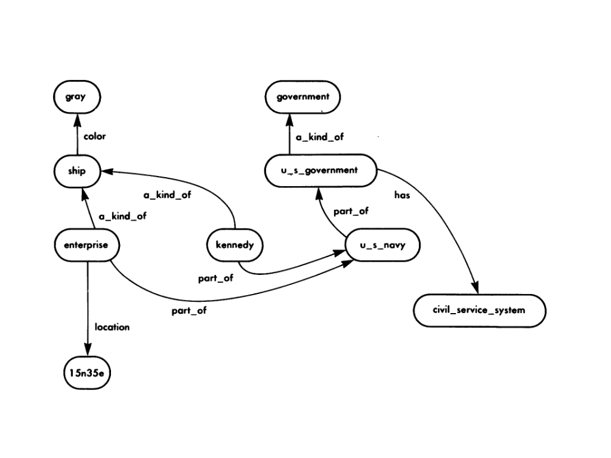

## Prolog crash course

### Representing facts

Prolog syntax and semantics are much closer to _formal logic_, the most common way of
representing facts and reasoning methods used in the artificial-intelligence
literature. The first thing is the _predicate expression_. Formally, a predicate
expression is a name - a predicate followed by zero or more arguments enclosed in
parentheses and separated by commas. Predicate names and arguments can be composed of any
mixture of letters and numbers, except that names for now must start with a **lower-case**
letter. The underscore symbol ```_``` also counts as a letter, and we will often use
it to make names more readable. So these are all predicate expressions:

```prolog
p(x)
q(y, 3)
city(monterey, california)
noarguments
pi(3.1416)
long_predicate_name(long_arguments_name, 3)
```

It could be in other language than English:

```prolog
кораб(българия)
пи(3.14)
дружба(русия, българия)
```

A period will signal the end of a fact. We could also tell the computer:

```prolog
% this is a comment
ship(kennedy).
ship(vinson).

% this was an example of type predicate
```

Predicates can mean many things. But they do fall into categories:

|                        | Type pred.     | Predicate property  | Relationship pred.  | Database pred. | Function pred. | Probability pred.|
|:-----------------------|----------------|---------------------|---------------|----------------|------------------|------------------|
| Number of arguments    |      1         |       2             |      2        |   1 or more    | 2 or more        | 1 or more |
| Nature of arguments    | a thing | a thing and property| two things | a thing and property | last is result of operation on others |last is probability of the fact truth |
| Description            | give a class that the thing belongs to | gives property of the thing  | describes relationship of two things | like a data record  | describes a function mapping | variant of previous kinds for partly certain facts |
| Examples               | ship(Kennedy) vehicle(ship)  | color(kennedy, gray) location(kennedy, 14n35e) | part_of(kennedy, us_navy) a_kind_of(kennedy, ship) | ship(kennedy, gray, 14n35e, 16feb85) | sum(3, 4, 7) | color(kennedy, gray, 0.8)  |
| Meaning of the examples| "The Kennedy is a ship" "A ship is a vehicle" | "The color of the Kennedy is gray" "The location of the Kennedy is 14n35e" | "The Kennedy is part of the US Navy" "The Kennedy is a kind of ship" | "There is a ship record with entries Kennedy, gray, 14n35e and 16feb85" | "The sum of 3, 4, 7" | "We believe with certainty 0.8 that the Kennedy is gray|

NOTE: We've said these predicates are like the types in computer languages, but there are
some differences. The main one is that they need never be defined anywhere. The type
(predicate) names are just arbitrary codes used in look up.

- Predicate property

Two-argument expressions in which the predicate name is the name of a property, the first
argument is the name of a thing, and the second argument is the value of the property. The
preceding example could be rewritten better as:

```prolog
ship(enterprise).
% shows the relation between 'gray' and 'enterprise'
color(enterprise, gray).
size(enterprise, big).
```

- Predicates for relationships

  They are important because a lot of human reasoning seems to use them - people need to
relate ideas. For instance, we can use a ```part_of``` predicate of two arguments which
says that its first argument is a component within its second argument.

We could give as facts:
```prolog
owns(tom, fido).
owns(tom, toms_car).
```
    It's easy to get confused about argument order in relationship-predicate expressions. So
we’ll try to follow this convention: if the predicate name is inserted between the two
arguments, the result will be close to an English sentence giving the correct meaning. So
if we insert "owns" between "tom" and "fido" we get "Tom owns Fido".
    Special relationship predicate is frequently used in artificial intelligence. It's called
```a_kind_of``` or ```is_a``` (we prefer the first name, because "is" is vague), and it
can replace all type predicates. Its first argument is a thing, and its second argument is
the type of that thing (the predicate name in the one-argument form considered
before).
    Pictures can make a complicated set of facts a lot clearer. There's a simple pictorial
way to show the predicate expressions we've been discussing: _the semantic network._
Unfortunately, there is a major restriction on it: semantic networks can only
directly represent predicates of two arguments (so type predicates must be in the
two-argument form). Let's illustrate with an example.

NOTE: this database will be used in following examples.

```prolog
a_kind_of(enterprise,ship).
a_kind_of(kennedy,ship).
part_of(enterprise,u_s_navy).
part_of(kennedy,u_s_navy).
part_of(u_s_navy,u_s_government).
a_kind_of(u_s_government,government).
color(ship,gray).
location(enterprise,15n35e).
has(u_s_government,civil_service_system).
```

Here is the picture:



- Loading a database

If this database is saved in a file called 'armada.pl' then start Prolog current directory
and type:

```prolog
?- consult('armada.pl').

% or

?-['armada.pl'].
```
after that you can do queries.

- Predicates with three or more arguments (database predicate, function predicates)

One idea is to include multiple property values and relationship information in a single
fact, much like adjectives and adverbs modifying a noun or verb. These sort of predicates
define a relational database of facts. Another important category of predicates with often
many arguments (though they can also have just two) is that representing results of
actions - in mathematical terminology, _functions_. Here is examples:

```prolog
sum(1,5,6).
sum(2,1,3).
sum(2,2,4).
sum(2,3,5).
sum(2,4,6).
```

NOTE: We will use function predicates frequently. To avoid confusion, we follow the
convention that _the last argument always represents the result of the function._

- Probability predicate

We have assumed so far that facts are always completely certain. In many situations, facts
are only probably true.  Then we will use the mathematical idea of probability, the
expected fraction of the time something is true. _We will put an approximate probability_
_as a last argument to a predicate._

### Variables and queries

We can put facts into a computer. So what can we do with them? Well, we want to _reason_
about facts and conclude new facts - what's called _inference._

One thing we can do with facts in a computer is to look them up.  You're in query mode
when the Prolog interpreter types ```?-``` at the front of every line. Query mode is the
way database query languages work, like SQL. Facts form _Prolog database_. Example:

```prolog
% note the period at the end
?- port_of(kennedy,u_s_navy).
```

So ```yes``` means _"I found it"_ and ```no``` means _"I couldn't find it._ We call a ```yes```
a query _success_ and ```no``` a query _failure._

- Queries with one variable

We might instead want to ask if a ```part_of``` fact
has enterprise as its first argument and anything at all as its second argument. We
can do this by querying

```prolog
?- partr_of(enterprise,X).
```
Read this as _"Find me an X such that part\_of(enterprise,X) is true"_, or simply as
_"What is the Enterprise part of?"_ The Prolog interpreter will go through its two-
argument facts in order, trying to match each to the query. When it finds one that matches
in predicate name and first argument, it will type ```X = ``` followed by the fact's
second argument, instead of typing yes. Or in technical jargon, it binds or matches ```X``` to a
value and prints it. ```X``` here is a variable.
    Prolog variables are designated by a capitalized first letter in a word (followed by
other letters and numbers, either capitalized or uncapitalized). Variables can only be
arguments in Prolog; they can't appear as predicate names. This means Prolog represents
only _first-order logic_. First-order logic is sufficient for nearly all
artificial-intelligence applications. A variable can appear anywhere among the arguments
to a predicate expression in a query:

```prolog
?- part_of(X,u_s_navy).
```
This means Prolog can answer quite different questions depending on where we put variables
in the query. We can have more than one variable in a query. If we were to query for our
database:

```prolog
% Asking: "What things are part of other things?"
?- port_of(X,Y).
```

- Matching alternatives

More than one thing (value) can match (bind) a query variable. The Prolog interpreter
will find the first, print it out, and stop and wait. If just one answer is sufficient,
type a carriage return. But to see the next answer (if any), type a semicolon (```;```) and
a carriage return. We can keep typing semicolons, and it will keep finding new matches,
until it can't find any more and it must answer ```no```.

- Multicondition queries

A Prolog interpreter also lets us specify that several different conditions must succeed
together in a query. This lets us specify _"chains of reasoning"_, like those so important
to detectives in mystery fiction. Let's illustrate with an example - suppose we want to
know the color of the ```Enterprise```:

```prolog
% this is wrong
?- color(enterprise,C).
```

we get ```no``` with our example database, because the ```color``` fact is about ships in gen-
eral and not the ```Enterprise```. Let's think over this "error". If you see the database
there is one fact ```color(ship, gray)```. This means that _all ships are gray_.
```color``` rule "understands" only from ships so we have to tell somehow that
```Enterprise``` is a ship and then pass the "result" to ```color```.

```prolog
?- a_kind_of(enterprise,T), color(T,C).
```

This represents an "and" (_conjunction_) of two predicate expressions, both of which must
succeed for the whole match to succeed. It works this way: we first try to answer the
query ```a_kind_of(enferprise,T).``` Then for that particular ```T```, we answer the query
```color(T,C).```. Using our example database, we first match ```T``` to ship in the
first-listed fact. We then look for a color fact in which this ```T``` is the first argument,
and the seventh-listed fact qualifies; we can then match ```C``` to gray. Prolog answer ```T = ship, C = gray```

So commas between predicate expressions in a query line mean to query the predicate
expressions in order, reusing the same values for any same named variables. Commas are
much like a logical "and" since all the subqueries (predicate expressions) must succeed
for the whole query to succeed. But Prolog commas, _unlike the logical "and," imply an_
_order of processing._

STYLE: To make commas easier to spot, we'll often put spaces after them in
       queries; these spaces are ignored by the interpreter.
       Don't put spaces in predicate expressions.

Logical "or" (_disjunction_) is represented by a semicolon instead of a comma.  As with
"and"s, the expressions of the "or" are tried in order.  Parentheses can group
subexpressions of "and"s and "or"s. Example:

```prolog
?- part_of(enterprise,X); (part_of(enterprise,Y), part_of(Y,X)).
```

This reads: _"Find me an X such that either the Enterprise is part of it, or the
Enterprise is part of some Y that is part of it."_

STYLE: (1) "and"s occur more often in applications,<br/>
       (2) they often require parentheses and so are hard to read, and <br/>
       (3) there is a better way to get the effect of an "or," we see later<br/>

So we have "and"s and "or"s. All we need to complete a Boolean algebra is a negation or
"not." This is accomplished by the built-in predicate not whose one argument is a
predicate expression.

```prolog
?- not(color(enterprise,green)).
```

How will the Prolog interpreter ever be sure something is not true? Strictly speaking, it
can't, since facts that directly say something is false are not permitted in Prolog. So
```not``` is defined to mean the interpreter couldn't find a fact in its_database-negation-by-failure_
or the _closed-world_ assumption.

Hint: Questions in English about a database often map directly into Prolog queries.
Words like "is", "are", "does" and "did" at the beginning of a question suggest
queries without variables (yes/no queries). Words like "what", "which", "who",
"where", "when", and "how" suggest variables.
