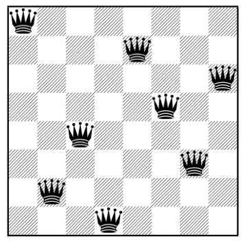
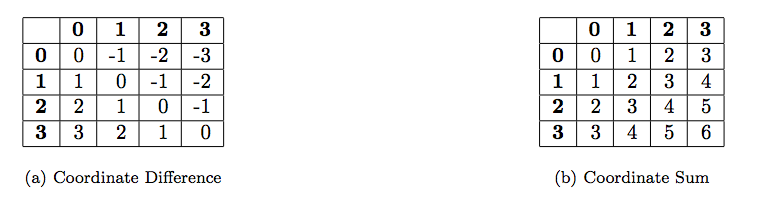

## The Problem

Let’s consider the problem of placing 8 queens on a chess board in such a way that none is
under attack. Here is one example of a possible board configuration:



## Abstract Data Types

To represent this problem, we will create a few abstract data types. We will need to
represent positions on the chess board, sequences of positions to represent a solution and
a chess board to register the positions occupied by the placed queens.

**NOTE:** The representations we will use are just for presentation purposes and they aren't
      the most appropriate for a more efficient implementation.

### Position

A position is a pair made of a line and a column:

``` cl
(defun make-position (line column)
    (list line colunm))

(defun position-line (position)
    (caar position))

(defun position-column (position)
    (caddr position))
```

### Positions

Positions are sequences of elements, each being a position:

``` cl
(defun make-positions ()
    (list))

(defun join-position (position positions)
    (cons position positions))
```

### Board

The chess board will contain the occupied positions and will allow us to check whether
some position is occupied.
   To this end, we will explore a mathematical property about chess boards that says that
all positions in a diagonal that goes up-left have the same coordinate difference and all
positions in a diagonal that goes up-right have the same coordinate sum.



The relevant operations for this type are the following:

``` cl
(defun make-board ()
  (list (list) (list) (list)))

(defun join-queen (position board)
  (let ((l (position-line position))
        (c (position-column position)))
    (list (cons c (car board))
          (cons (+ l c) (cadr board)) (cons (- l c) (caddr board)))))

(defun attacked-queen-p (position board)
  (let ((l (position-line position))
        (c (position-column position)))
    (or (member c (car board))
        (member (+ l c) (cadr board))
        (member (- l c) (caddr board)))))
```

### Program

The program implements an backtracking algorithm that attempts to place a queen in a given
line, checking column by column until it finds the non-attacked position or until it runs
out of columns. In this last case, it returns false (i.e., `nil`), otherwise, it places
the queen in the chess board and it tries to solve the problem for the remaining queens
(on the next lines). If a solution if found for this subproblem (i.e., the recursive call
didn’t return false), it joins the found position to the solution, otherwise it tries
another column.

``` cl
(defun queens (n)
  (place-queens n n n (make-board)))

(defun place-queens (n i j board)
  (cond ((= i 0)
         (make-positions))
        ((= j 0) nil)
        ((attacked-queen (make-position i j) board)
         (place-queens n i (1- j) board))
        (t
         (let ((result (place-queens n
                                     (1- i)
                                     n
                                     (join-queen (make-position i j)
                                                 board))))
           (if result
               (join-position (make-position i j) result)
               (place-queens n i (1- j) board))))))
```

## Tests

All the above code is placed in `buggy-example.lisp`. The first step is to compile/load
the source file. Type `M-x slime` and you have REPL. It is very important to now current
REPL directory - type comma `,` and then in mini-buffer `pwd`. It should be directory
where `buggy-example` is placed. Now you have two options to compile/load the file.

- Use `load`. In our case `(load "buggy-example")` from REPL.
- Use use SLIME `C-c C-k` (clever way) when you are in `buggy-example`.

If you use `load` problems will be hidden and you will hit them during testing better way
is to use SLIME shortcut - `C-c C-k`. Ops there is compilation errors:

```
3 compiler notes:

buggy-example.lisp:1:1:
  style-warning:
    The variable COLUMN is defined but never used.
    --> PROGN
    ==>
      (SB-IMPL::%DEFUN 'MAKE-POSITION
                       (SB-INT:NAMED-LAMBDA MAKE-POSITION
                           (LINE COLUMN)
                         (BLOCK MAKE-POSITION (LIST LINE COLUNM)))
                       NIL 'NIL (SB-C:SOURCE-LOCATION))


buggy-example.lisp:2:3:
  warning: undefined variable: COLUNM

buggy-example.lisp:39:10:
  style-warning: undefined function: ATTACKED-QUEEN

Compilation failed.
```

and SLIME ask you if you want to load file anyway - type `n` because they are easy one.
Let's try to fix them one by one.

First two are connected - typo that should be fixed: `colunm` should be `column`. Again
`C-c C-k` - only one warning! (`C-c C-z` to go to REPL):
```
; file: /Users/zzhelyaz/projects/github/study-paip/debug/buggy-example.lisp
; in: DEFUN PLACE-QUEENS
;     (ATTACKED-QUEEN (MAKE-POSITION I J) BOARD)
;
; caught STYLE-WARNING:
;   undefined function: ATTACKED-QUEEN
;
; compilation unit finished
;   Undefined function:
;     ATTACKED-QUEEN
;   caught 1 STYLE-WARNING condition
```

Hmm, again typing problem.

Should be `attacked-queen-p`. In `buggy-example` type `M-g M-g` and go to the line
**39**. Change `attacked-queen` to `attacked-queen-p` and then re-evaluate `place-queens`
with `C-c C-c` and `C-c C-z` to go to the REPL.

Time for real tests.

```
CL-USER> (queens 4)
```
Problems again

```
The value 4 is not of type LIST.
   [Condition of type TYPE-ERROR]

Restarts:
 0: [RETRY] Retry SLIME REPL evaluation request.
 1: [*ABORT] Return to SLIME's top level.
 2: [ABORT] Abort thread (#<THREAD "repl-thread" RUNNING {1004470023}>)

Backtrace:
  0: (POSITION-LINE (4 4))
  1: (ATTACKED-QUEEN-P (4 4) (NIL NIL NIL))
  2: (PLACE-QUEENS 4 4 4 (NIL NIL NIL))
  3: (QUEENS 4)
```
_TIP: SLIME colors in green all useful frames._

Now the real Lisp power. Place marker on the last frame `(POSITION-LINE (4 4))` and type
`v` and you will be placed in the right place - `(caar position)`. Of course - should be
`car` not `caar`. Change it and `C-c C-c`. The return to the debugger `C-x o` if it is in
the other window.

_TIP: If you lost debugger window type `C-z d` and you are there._

Type zero `0` to `[RETRY]` this time with the new function or `r` for restart frame.
Now something else:

```
Argument Y is not a NUMBER: NIL
   [Condition of type SIMPLE-TYPE-ERROR]

Restarts:
 0: [RETRY] Retry SLIME REPL evaluation request.
 1: [*ABORT] Return to SLIME's top level.
 2: [ABORT] Abort thread (#<THREAD "repl-thread" RUNNING {1004470023}>)

Backtrace:
  0: (SB-KERNEL:TWO-ARG-+ 4 NIL)
  1: (ATTACKED-QUEEN-P (4 4) (NIL NIL NIL))
  2: (PLACE-QUEENS 4 4 4 (NIL NIL NIL))
  3: (QUEENS 4)
  4: (SB-INT:SIMPLE-EVAL-IN-LEXENV (QUEENS 4) #<NULL-LEXENV>)
  5: (EVAL (QUEENS 4))
```

Remember that SLIME colors useful frames with green? This time `1 2 3 and 5` are meaningful.
Go with the marker on `(ATTACKED-QUEEN-P (4 4) (NIL NIL NIL))` and press `Enter` to see all
parameters.

```
  1: (ATTACKED-QUEEN-P (4 4) (NIL NIL NIL))
      Locals:
        BOARD = (NIL NIL NIL)
        C = NIL
        #:G43 = NIL
        L = 4
        POSITION = (4 4)
```

This time, the message is not sufficiently clear and it is convenient to get some more
information.

_TIP: Type `C-h m` in debugger to see all available commands._

One simple way to achieve that is to call the function in its interpreted form.
_How can we achieve this?_

In **.sbclrc** add following line:

```cl
;; Add maximum debug information
(declaim (optimize debug))
(sb-ext:restrict-compiler-policy 'debug 3)
```

_TIP: See if it is enabled with `(sb-ext:describe-compiler-policy)` in REPL._

and you will have maximum debug information when there is an error. Another way is to
place cursor in function and type `C-u C-c C-c` and then back in debugger and type `r` for
retry. Because I have above line in my `.sbcl` file extra information is in the top frame:

```
Backtrace:
  0: (SB-KERNEL:TWO-ARG-+ 4 NIL)
      Locals:
        SB-DEBUG::ARG-0 = 4
        SB-DEBUG::ARG-1 = NIL
```

Again a little bit confusing. `(SB-KERNEL:TWO-ARG-+ 4 NIL)` should be read `(+ 4 NIL)`.

We see that the variable that refers to the column of the position has the value `nil`,
meaning that there is a problem in the corresponding selector. We will check its behavior
using the **trace** operation. To this end, we move temporarily to the REPL (that still
shows that we are under a debugging session and there is no prompt). Press `Enter` and
prompt will be given:

```
CL-USER> (queens 4)

; No value
CL-USER> (trace position-column)
(POSITION-COLUMN)
CL-USER>
```

We return to the debugger and, to be sure that the selector will be called again, we
execute a restart some frames bellow, on the line that contains `1: (ATTACKED-QUEEN-P (4
4) (NIL NIL NIL))` and we get the error again (as expected), but before that the function
position-column shows its invocation:

```
0: (POSITION-COLUMN (4 4))
0: POSITION-COLUMN returned NIL
```

By the way did you met that SBCL returned strange error message:

```
Argument Y is not a NUMBER: NIL
   [Condition of type SIMPLE-TYPE-ERROR]
```

There is no `Y` in `attacked-queen-p`. From where it comes from?

Go to the top level, line that contains `0: (SB-KERNEL:TWO-ARG-+ 4 NIL)` and type `M-.`
when you are on SB-KERNEL:TWO-ARG-+.

It opens `numbers.lisp` from SBCL source:

``` cl
(two-arg-+/- two-arg-+ + add-bignums)
(two-arg-+/- two-arg-- - subtract-bignum)

(defun two-arg-* (x y)
  (flet ((integer*ratio (x y)
  ........
```

**ATTENTION:** To have `M-.` working for SBCL definitions you have to type:<br/>
`(sb-ext:set-sbcl-source-location "<SBCL source location>")` or place it in **.sbclrc**.

Anyway let's continue chasing bugs. It is clear that the error is in the `position-column`
selector because it gives second parameter. We edit the this function (we know the
process - go there and edit it, `C-c C-c` then retry)

To obtain the second element of the list that represents a position the correct operation
to use is `cadr` and not `caddr`:

``` cl
(defun position-column (position)
    (cadr position))
```

Retry and...wrong answer:

```
CL-USER> (queens 4)
NIL
```

Unfortunately, the answer is wrong. In fact, there are several solutions to the 4 by 4
board. To understand the problem, let's visualize the execution of the place-queens
function.
To this end, we should ask for an interpreted execution (extra debug information `C-u C-c
C-c`) because in a compiled function the recursive calls might not show up in the
trace. In REPL type `(trace place-queens)`. Result is quite long:

```
CL-USER> (trace place-queens)
(PLACE-QUEENS)
CL-USER> (queens 4)
  0: (PLACE-QUEENS 4 4 4 (NIL NIL NIL))
    1: (PLACE-QUEENS 4 3 4 ((4) (8) (0)))
      2: (PLACE-QUEENS 4 3 3 ((4) (8) (0)))
        3: (PLACE-QUEENS 4 3 2 ((4) (8) (0)))
          4: (PLACE-QUEENS 4 2 4 ((2 4) (5 8) (1 0)))
            5: (PLACE-QUEENS 4 2 3 ((2 4) (5 8) (1 0)))
              6: (PLACE-QUEENS 4 2 2 ((2 4) (5 8) (1 0)))
                7: (PLACE-QUEENS 4 2 1 ((2 4) (5 8) (1 0)))
                  8: (PLACE-QUEENS 4 2 0 ((2 4) (5 8) (1 0)))
                  8: PLACE-QUEENS returned NIL
                7: PLACE-QUEENS returned NIL
              6: PLACE-QUEENS returned NIL
            5: PLACE-QUEENS returned NIL
            4: PLACE-QUEENS returned NIL
            ....
```
That’s too much information. Let’s use a smaller example:

_TIP: `C-u C-c C-c` and `C-u C-c C-k` will compile code with **DEBUG** optimization set to 3_

```
CL-USER> (queens 1)
  0: (PLACE-QUEENS 1 1 1 (NIL NIL NIL))
    1: (PLACE-QUEENS 1 0 1 ((1) (2) (0)))
    1: PLACE-QUEENS returned NIL
    1: (PLACE-QUEENS 1 1 0 (NIL NIL NIL))
    1: PLACE-QUEENS returned NIL
  0: PLACE-QUEENS returned NIL
  NIL
```

In fact, there’s something wrong - returned `nil` is always suspicions!
The board 1×1 has an obvious solution that it is not found.

To analyze the problem, we will execute the function **step-by-step**. First, we remove
the trace (using **untrace**) because the step-by-step shows more or less the same
information.

```
CL-USER> (untrace place-queens)
T
CL-USER> (step (queens 1))
```

We have to reach `place-queens` so first choose `3: [STEP-INTO] Step into call`
then `2: [STEP-NEXT] Step over call` now we are ready to call `place-queens`:

```
Evaluating call:
  (PLACE-QUEENS N N N (MAKE-BOARD))
With arguments:
  1
  1
  1
  (NIL NIL NIL)
   [Condition of type STEP-FORM-CONDITION]
```

_TIP: Type `i` in debugger to view detail information of a symbol._

**ATTENTION:** SBCL _step_ function do not display what function returns as Allegro CL do.
Because of that it is very difficult to find out which function returns `nil`.

One possible solution is to use _step_ and evaluate in frame expressions - in debugger
press `e`.

_TIP: To change value press `e` in debugger. At the prompt, type_
      _`(setq *value-to-be-changed* nil)` and press **Enter** and then re-evaluate._


Another is to trace every function in suspicions function. Here is the result:

```
CL-USER> (queens 1)
  0: (PLACE-QUEENS 1 1 1 (NIL NIL NIL))
    1: (ATTACKED-QUEEN-P (1 1) (NIL NIL NIL))
    1: ATTACKED-QUEEN-P returned NIL
    1: (JOIN-QUEEN (1 1) (NIL NIL NIL))
    1: JOIN-QUEEN returned ((1) (2) (0))
    1: (PLACE-QUEENS 1 0 1 ((1) (2) (0)))
      2: (MAKE-POSITIONS)
      2: MAKE-POSITIONS returned NIL
    1: PLACE-QUEENS returned NIL
    1: (PLACE-QUEENS 1 1 0 (NIL NIL NIL))
    1: PLACE-QUEENS returned NIL
  0: PLACE-QUEENS returned NIL
```

`attacked-queen-p` is a predicate so returned `nil` is not a problem. Why `make-positions`
returns `nil`? It should return list. That is the problem!

``` cl
(defun make-positions ()
    (list 'end))
```

That's all!
